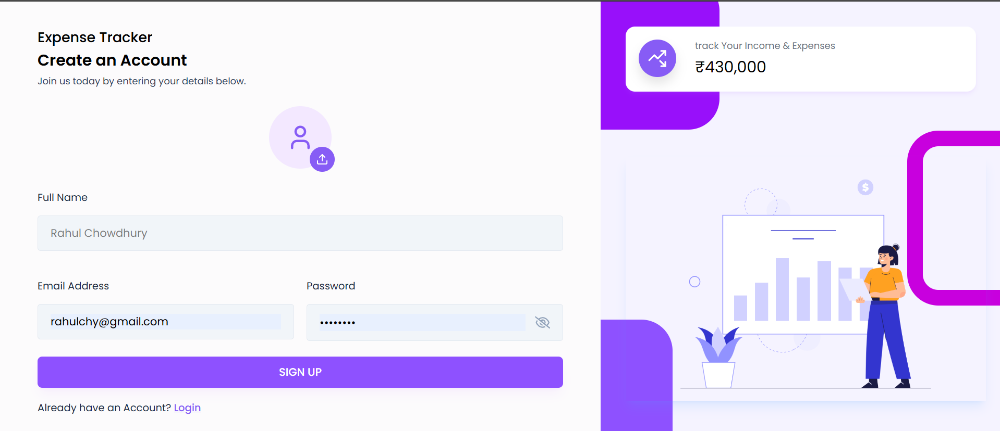
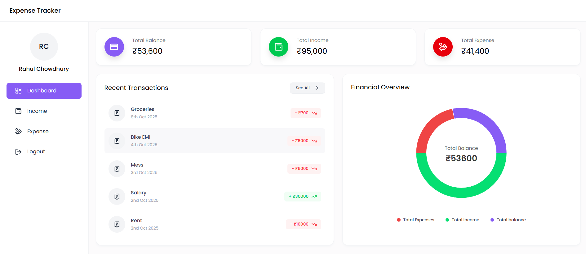
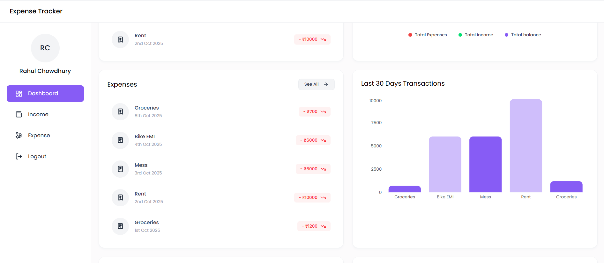
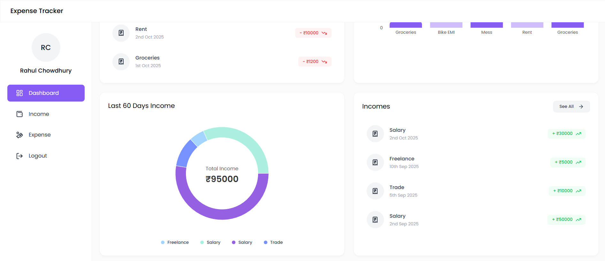
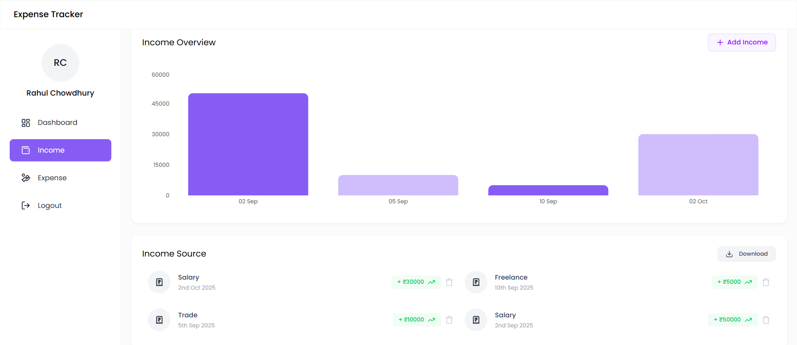
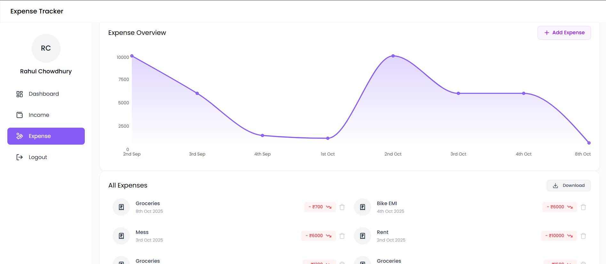

# Expense Tracker

A full-stack expense management platform that lets individuals capture income and expense transactions, visualize spending trends, and export data for further analysis. The app combines an Express and MongoDB REST API with a modern React plus Tailwind UI.

Live: [Open App](https://expense-frontend-wztk.vercel.app/login)

## Features
- **Secure authentication** – Register, login, and fetch the current profile via JWT-protected endpoints; optional profile avatars are stored via Multer and served from <code>/uploads</code>.
- **Transaction management** – Add, list, and delete income and expense entries with category or source, amount, date, and emoji icons.
- **Analytics dashboard** – Monitor total balance, income, and expense summaries plus recent activity cards; charts update automatically from API data.
- **Data visualization** – Recharts-powered pie, bar, and line charts highlight last 30 or 60 day trends, category breakdowns, and overall health.
- **Data export** – Download income or expense data as CSV directly from the UI; backend endpoints can also return Excel files when called.

## Tech Stack
| Layer | Technologies |
| --- | --- |
| Backend | Node.js, Express 5, MongoDB Atlas, Mongoose, JWT, Multer, bcryptjs |
| Frontend | React 19, Vite, Tailwind CSS, Recharts, React Router, React Hot Toast |
| Tooling | Axios, Nodemon, Emoji Picker, dotenv |

## Project Structure

    Expense-Tracker/
    ├── README.md
    ├── backend/
    │   ├── config/            # Database connection helper
    │   ├── controllers/       # Auth, income, expense, dashboard logic
    │   ├── middleware/        # JWT guard and image upload handling
    │   ├── models/            # Mongoose schemas for User, Income, Expense
    │   ├── routes/            # REST API route definitions
    │   ├── server.js          # Express bootstrap
    │   └── uploads/           # Stored profile images (served statically)
    └── frontend/
        └── expense-tracker/
            ├── src/
            │   ├── components/   # Reusable UI blocks, charts, forms
            │   ├── context/      # Global user context
            │   ├── hooks/        # Auth guard hook
            │   ├── pages/        # Auth plus dashboard feature pages
            │   └── utils/        # API helpers, formatters, constants
            ├── public/
            └── vite.config.js

## Getting Started

### Prerequisites
- Node.js 18 or newer plus npm
- MongoDB connection string (local instance or Atlas)

### Backend Setup
1. Move into the backend folder: <code>cd backend</code>
2. Install dependencies: <code>npm install</code>
3. Create a <code>.env</code> file (never commit secrets) with the following keys:

       PORT=8000
       MONGO_URL=mongodb+srv://&lt;username&gt;:&lt;password&gt;@&lt;cluster&gt;/expense-tracker
       JWT_SECRET=&lt;generate-a-strong-secret&gt;
       CLIENT_URL=http://localhost:5173

4. Start the API:
   - Development: <code>npm run dev</code>
   - Production: <code>npm start</code>

The API exposes routes under <code>http://localhost:8000/api/v1/...</code> by default.

### Frontend Setup
1. Move into the frontend workspace: <code>cd frontend/expense-tracker</code>
2. Install dependencies: <code>npm install</code>
3. Optional: create <code>.env</code> for Vite overrides (values must be prefixed with <code>VITE_</code>):

       VITE_BASE_URL=http://localhost:5173

   The default API root is defined in <code>src/utils/apiPaths.js</code>. Update that file or the environment variable if your backend runs elsewhere.

4. Start the UI: <code>npm run dev</code> (Vite serves at http://localhost:5173).

## Running the App
- Ensure the backend is running on the port referenced by the frontend (the <code>BASE_URL</code> constant).
- Launch the frontend via Vite and open the provided URL.
- Sign up, optionally upload an avatar (stored in <code>backend/uploads</code>), and begin recording transactions.

## API Overview
All protected routes require an <code>Authorization: Bearer &lt;token&gt;</code> header.

| Method | Endpoint | Description |
| --- | --- | --- |
| POST | /api/v1/auth/register | Create a user and return JWT plus profile data |
| POST | /api/v1/auth/login | Authenticate a user and return JWT plus profile data |
| GET | /api/v1/auth/getUser | Fetch the current user profile |
| POST | /api/v1/auth/upload-image | Upload a profile image (form-data field named <code>image</code>) |
| POST | /api/v1/income/add | Create an income record |
| GET | /api/v1/income/get | List all income records for the user |
| DELETE | /api/v1/income/:id | Delete an income entry |
| GET | /api/v1/income/downloadexcel | Download income data as an Excel file |
| POST | /api/v1/expense/add | Create an expense record |
| GET | /api/v1/expense/get | List all expense records for the user |
| DELETE | /api/v1/expense/:id | Delete an expense entry |
| GET | /api/v1/expense/downloadexcel | Download expense data as an Excel file |
| GET | /api/v1/dashboard | Aggregate totals, recent transactions, and chart data |

## Key Modules
- **Auth flow**: <code>authController.js</code> issues JWTs and <code>authMiddleware.js</code> protects routes.
- **Income and expense logic**: Controllers validate input, persist to MongoDB, and expose download helpers.
- **Dashboard analytics**: <code>dashboardController.js</code> aggregates totals, last 30 or 60 day metrics, and recent transactions.
- **React UI**: Dashboard pages in <code>src/pages/Dashboard</code> compose overview cards, charts, and transaction lists with shared components.

## Screenshots
Add your imagery by replacing the placeholder paths below (five slots provided):

